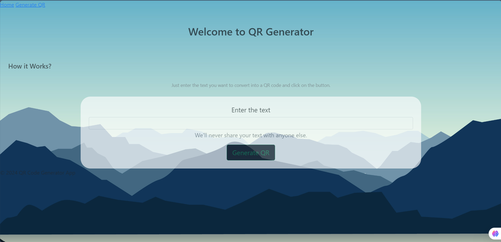

# QR Code Generator Web App

This web application allows users to generate custom QR codes from text, URLs, or other data. It's a simple and interactive tool built using Flask, offering an intuitive interface for creating and downloading QR codes.

## Features:
- **Customizable QR Codes**: Generate QR codes from text, URLs, or other user-input data.
- **Instant QR Code Generation**: QR codes are generated instantly after submission.
- **Download Option**: Users can download their generated QR code as an image file.
- **Responsive Design**: The app is designed to be user-friendly on both desktop and mobile devices.
- **Flask Backend**: Built using Flask to handle requests and render dynamic content.

## Tech Stack:
- **Python** (Flask for the web framework)
- **HTML/CSS** (For the user interface)
- **QRCode** Python Library (For generating QR codes)

## Installation

1. Clone this repository to your local machine:
   ```bash
   git clone https://github.com/yourusername/qr-code-generator.git
   ```

2. Navigate to the project directory:
   ```bash
   cd qr-code-generator
   ```

3. Install the required dependencies:
   ```bash
   pip install -r requirements.txt
   ```

4. Run the Flask application:
   ```bash
   python app.py
   ```

5. Open your browser and navigate to `http://127.0.0.1:5000/` to access the app.

## Usage

- Enter the text or URL you want to convert into a QR code.
- Click the "Generate QR Code" button to instantly generate the QR code.
- Download the generated QR code image for your use.

## Screenshots




## Contributions

Feel free to fork this repository, open issues, or submit pull requests. Contributions are always welcome!

## License

This project is licensed under the MIT License - see the [LICENSE](LICENSE) file for details.

---

This README is ready to go with placeholders for your screenshot and instructions for anyone who wants to use or contribute to the project.
